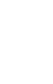
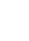
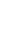
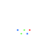
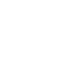
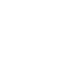

# Research in understanding

## The divide

There are many ways to compare the tools used to write software. One of these commonly-used metrics is **level** &ndash; tools are sometimes considered *high*-level or *low*-level.

In computer science, these terms are most commonly used to signify how far abstracted away the tool is from the hardware it runs on. High-level tools are characterised by generalisation of problems, automatic handling of underlying system operations, portability, and reliance on low-level tools, whereas low-level tools tend to provide control over specific system details, performance, and specialisation for particular types of system.

The following diagram will be used to illustrate the relationship between high-level and low-level tools. Positions on the chart are extremely simplified and arguable, precision could be improved by adding more dimensions or factors such as complexity.

The descriptors 'high' and 'low' mean what they do because of the way nearly all software is built, relying on hardware, hardware control layers, instruction set architectures, systems languages, transport & communication protocols, interpreters, libraries, applications, user interfaces... onwards and upwards forever.

From the other end of the scale, mathematical concepts can be thought of being built from the opposite direction. Founded on axioms written in natural language, abstract and normally considered very high-level, and built up through logic and theorems to become formalised and rigorous enough to be useful in practice.

Regardless of which end a system builds from, the ability to build on top of existing tools and abstractions is critical for implementing complex systems.

Let us take 2 examples of systems for expressing computations: lambda calculus and Turing machines.

The untyped lambda calculus is built only from functions, parameters, and applications. All data must be expressed as parameters or functions, and expressions are evaluated using β-reduction &ndash; repeated substitution of parameters for their values.  
Each function takes 1 parameter and results in 1 output value, both of which are functions, as functions are the only method of expressing data. Functions can be combined to create multi-parameter functions and multiple outputs, and recursion can be used to express iteration.

The Turing machine is built only from a set of infinite tapes of symbols from its alphabet and a head for each tape that can read and change symbols on the tape at its location and move left or right. The behaviour of the heads are controlled by a machine that changes its state based on its current state and the symbol it reads, and programs are evaluated by letting the state machine run until it halts.  
The simplest Turing machine has 1 tape and 2 symbols in its alphabet. The tape can also be semi-infinite, that is having only 1 end, though a truly infinite tape can be easier to reason about as the behaviour at the end of the tape doesn't need to be considered.

Lambda calculus is easily representable in standard mathematics, with standard function notation and parameters. A Turing machine is easily representable in machine code, with a section of memory for the tape and a table for defining possible states. As such, the systems can be thought of as high-level and low-level respectively.

These systems, easy to think of as worlds apart, share some remarkable similarities. The Halting problem states that, for any input program or formula, there is no algorithm to determine whether it will complete, resolve to a value, or halt execution, or whether it will run forever without completing. Both lambda calculus and Turing machines are subject to the Halting problem: in lambda calculus, an expression can evaluate to itself or another expression containing itself, and a Turing machine can enter a loop of states that never reaches a halting state.  
If there exists an algorithm to determine whether an input to any computational system will halt, then the computational system cannot be Turing complete. This does not mean that the system is not useful, and any Turing complete system can be restricted to a non-Turing complete subset of itself. Take, for example, a turing machine that halts after a N state transitions, or a lambda calculus that disallows more than N β-reductions. For a large enough N these systems might be able to calculate every practical computation problem in the universe. It will always be possible to construct a theoretical problem requiring more than N transitions/reductions to solve, though it may never be possible to construct a general program to practically determine whether the environment it is running in is *truly* turing-complete.

The Church-Turing thesis shows that these 2 models of computation have equivalent computational power, and that each can simulate the other &ndash; they are equal.

This shows there is nothing inherently preventing software from going in the opposite direction, for example if it were useful to write a hardware simulator in a high-level language. This could allow low-level implementation details and high-level simulation logic to be expressed with a coherent system.

 If accurate enough, the tools used to build the system could then be built on top of the simulator. This could be done any number of times, resulting in an infinite loop of simulators built on top of themselves. This is an extremely powerful concept, though in practice isn't useful if a system isn't built with this in mind, as there will be a loss of efficiency at each level, eventually resulting in a program that is too slow (will not complete in the expected lifetime of the universe).

 Any simulation of a universe which contains a model of the machine used to run it cannot have the simulated machine run as fast as the physical machine, as every simulation has some level of overhead. However, it is possible to get remarkably close, which will be expanded on later.

 ## Virtual machines

 A virtual machine is a software representation of a computer system. These can be split into 2 categories: system virtual machines, which accurately simulate a real-world computer system, and process virtual machines, which simulate an abstract environment that doesn't exist in hardware. This series of documents will focus chiefly on process virtual machines, hereinafter referred to as just VMs.

 The purpose of a process VM is to provide a platform-independent programming environment &ndash; a system that can be reimplemented and run on many different host environments, even if they're heavily sandboxed, and provide portability for programs written for them. VMs are commonly written for interpreted programming languages, languages that compile to VM machine code to then be run or distributed as either source code or VM code. Another common use is in emulation projects to create a programming environment with a retro feel for fantasy consoles or computers, their restrictive environments giving rise to creative tricks and workarounds.

 In some cases, when writing programs targeting a certain VM, the underlying system and its implementation can be ignored entirely. An entire world's worth of software can be built without caring about low-level implementation details &ndash; the floor can be raised and what is 'low-level' can be reconsidered, in a kind of ignorance that provides strength.

The smaller and simpler the design and implementation of a VM is, the more portable it and its suite of software on top of it becomes, and the easier it is to reason about the system as a whole, generally making it easier to write and maintain software for that VM.

After the design is complete and implementations are widespread, it may also be possible to remove the lower cone from the diagram entirely by providing a direct hardware implementation, a kind of VMPU, if its design is suited well enough for it.

In the above diagram, the lower cone represents the VM implementation, with the height showing how much abstraction is provided away from the underlying platform, the width of the footprint showing how much complexity there is to implement the VM, and the width of the tip representing the VM itself. It is represented as a cone due to the fact that the implementation complexity is greater than the complexity of the VM itself &ndash; if the VM were to have greater complexity, then it is likely that the implementation would as well. A VM with greater complexity than its implementation would certainly be a curious design choice, though does not seem to have applicable benefits in this context.

One good set of targets to aim for might be a VM, as simple (as in not complicated) and simple (as in not complex) as possible, with an implementation that provides a maximum level of abstraction away from the base platform with a minimal implementation footprint. This provides a foundation for beginning work on design decisions. However, there is one factor that has not been considered yet: its performance.  
No VM design can strictly limit the performance of its implementation, though misguided design decisions could end up negatively impacting its aims in other ways. Take the example of a basic VM for implementing arithmetic, which might have operations (or 'opcodes', where applicable) for addition, subtraction, multiplication, and division. The VM design could certainly be simplified by removing every operation and replacing them with a single "increment by 1" instruction. Addition and subtraction would just be repeated increments, and multiplication and division would be repeated addition and subtraction. Thus the simplicity of the VM is maximised, but at the cost of performance, as every arithmetic operation would take far longer to complete. As such, a basic implementation might still be less complicated, but its ability to perform useful work would be limited. Any implementation with a reasonable level of performance could recognise these algorithms for arithmetic operations and optimise them to be as efficient as the original design, but this new implementation might be more complex than an original design implementation.

This technique of moving complexity out of the VM design and into algorithms implemented on it is a powerful tradeoff, and the idea of optimising the performance of these algorithms will hereinafter be referred to as 'jets'. As a sufficiently (infinitely) clever interpreter would be able to solve any computation problem in constant time (O(1), though the 1 may be very large), the highest performance implementations for any given VM will likely use jets extensively at the cost of implementation difficulty. The more interesting idea is whether they are required at all, or where to draw the line at having a minimally complex VM such that the simplest implementation, utilising no jets, can still perform "well enough" for practical use cases.

The alternative to this idea of a jetless VM is one where only the minimum instructions possible are available directly, and all others have to be built on top of them via jetted algorithms. This decreases the implementation difficulty of the minimum working VM, allowing it to work correctly for the simplest programs, though perhaps not meeting performance requirements for larger ones. Again taking the example of the basic arithmetic VM, to achieve performance requirements, there may need to exist jets for the algorithms for addition, subtraction, multiplication, and division.  
The benefits of this approach are that a minimum working VM is easier to implement, and that when increased performance is required, the jets can be tested alongside their standard algorithmic counterparts to ensure they work correctly under all circumstances. The disadvantages may include the possibility that jets are more difficult to implement than standard operations, as well as the difficulty of recognising whether a given algorithm even needs to be jetted while the VM is running.

A VM relying so heavily on jets would also need to more carefully consider their inherent shortcomings, such as the requirement that jets must perform identically within the VM as the algorithms they replace. Failing to satisfy this requrement, for example by having a jet for an algorithm that returns incorrect results, could result in dire consequences &ndash; if a VM were to persist state then this state could be corrupted, if it were to require determinism then this determinism could be contaminated, and the otherwise perfect computational model of these VMs would be ruined. If the VM is implemented in a language that supports a formal specification or proof system, this risk can be minimised.  
It could be argued that any bug could appear in any feature of a VM implementation, regardless of whether it uses a jet for that feature, and so this risk is not unique to jets. Thus the focus should be to minimise complexity in all areas of the implementation, and whether jets are a useful tool for doing so will be at the discretion of the designers of the VM and the programmers of its implementations.

However, there does exist one great benefit of a certain type of jet implementation. In many cases, it is desirable to have an implementation of a VM written in VM instructions and running on itself, even if the VM already has support for evaluating data as code. This could be beneficial for sandboxing, program testing, debugging, or bootstrapping purposes, as well as simply having a reference implementation of the VM built in itself to minimise bias towards any existing programming language in terms of implementation techniques. Under a usual implementation, this would result in performance degradation &ndash; as mentioned previously, every level of simulation adds overhead, and so may end up too inefficient to be practical if there are many layers of it. The solution here is to jet the self-hosted implementation of the VM to itself, bringing down the overhead to effectively none. The risk of a bug in the jet implementation here is equal to the risk of a bug in the VM implementation itself.

All things considered, the costs and benefits jets must be carefully weighed against each other, both for the VM and the environments it may run in. The truth is that any VM will almost certainly need to run on a wide variety of existing hardware and software to be seen as useful, which means implementing the VM many times over in many different programming environments. And for most popular programming languages, the complexity required for performing some complicated operations is surprisingly low &ndash; for a common implementation definition of 'number', multiplying or dividing a number is not a significant complexity jump from simply incrementing it by 1. A VM designer may wish to take advantage of any easily implementable operations available and allow them to be used directly, due to their relatively small impact on implementation difficulty.

## Input, state, and output

The nature of a function, in a pure mathematical sense, is to map one set of values to another. The nature of its analogue in the sense of computation is a procedure, which performs a series of operations on some input, and may also return some output. If there is no way to provide input to either, they are effectively static in their behaviour (assuming they exist in a fully deterministic environment), and if there is no way to retrieve output from either, they will be unable to perform useful work. For a VM to be dynamic and useful, there should be a clearly defined method of providing input and retrieving output alongside the clear definitions of the operations it can perform.

A VM can be thought of as a black box, taking an input and producing an output. The state of the VM can be considered as part of the input, and the output can include the new state of the VM after execution. This serves to maintain determinism, as the same input (and initial state) will always produce the same output (and final state). This state could perhaps include the code of the program being executed, a piece of data including both the program to be run and the inputs it is to be run with, or the contents of internal registers or working memory, depending on the design of the VM. If the entirety of the input and output of the VM is thought of as state, the VM can be seen as a state machine.  
Any program running on such a VM can be thought of in exactly the same way, with the VM taking both the program and the program's input as the input to the VM, and producing as output the output of the program if run on the input &ndash; similarly to a universal Turing machine. The implementation of the VM can provide any program and its input to the VM, run it to completion to retrieve the output (or cut it off if it does not complete), and inspect the output to ensure it matches an expected format. The output can then be extracted from this format, and if the program contains a new state or new program code, which may be identical to its current state/code, the new state can be provided back to the program for the next execution or the new program code can be run on the VM again.
